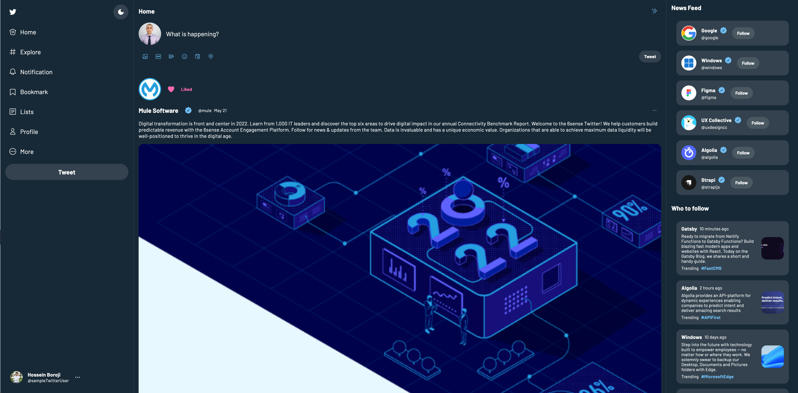

# Twitter Clone

A Twitter clone written with pure JavaScript and using Lit to deliver web components

## Getting Started

Clone this repository.

## Running the code

If you have VSCode you can use the live-server extension to run `index.html` and that will get you up and running.

## Light Mode

## Dark Mode

## Resources

- <https://lit.dev/>
